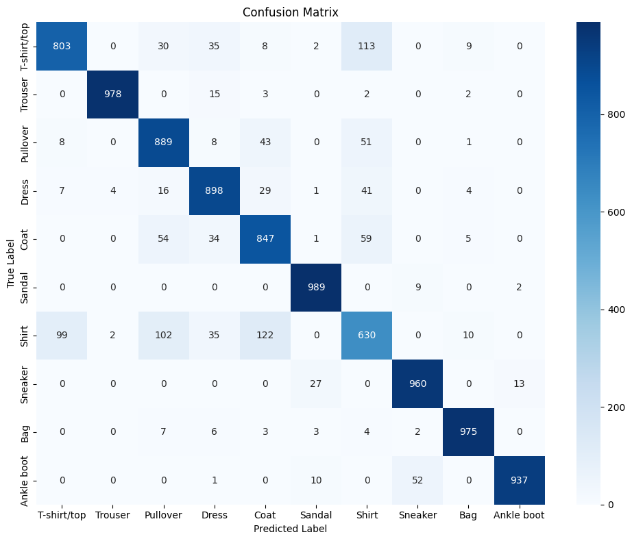
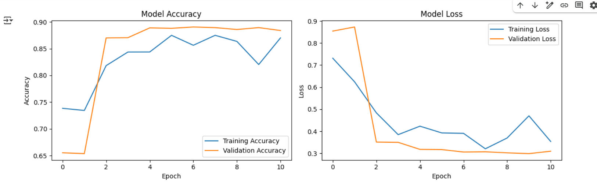
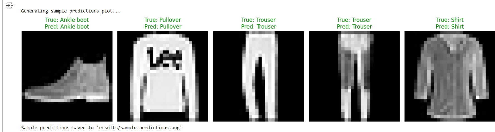

# Fashion-MNIST CNN Classifier

A Convolutional Neural Network built with **TensorFlow/Keras** to classify fashion images.

## Results
- **Test Accuracy**: ~89%
- **Techniques**: Data Augmentation, BatchNorm, Dropout
- **Validation**: Confusion matrix, per-class metrics, sample predictions

##  Run in Google Colab
https://colab.research.google.com/github/hishmaizamy/fashion-mnist-cnn/blob/main/fashion_mnist_cnn.ipynb

### Confusion Matrix

### Training History

### Sample Predictions

### Full Metrics
See: [classification_report.txt](classification_report.txt)

## Files
- `fashion_mnist_cnn.ipynb` – Full code and outputs
- `*.png` – Visual results
- `classification_report.txt` – Per-class precision/recall

- `requirements.txt` – Dependencies

